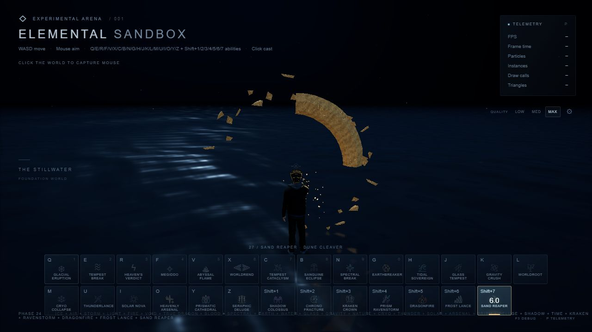
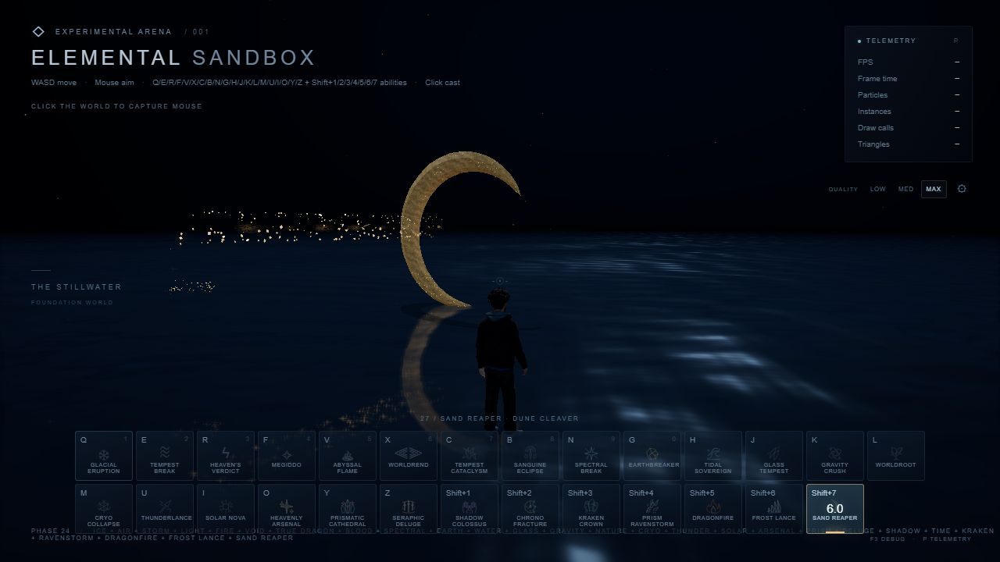
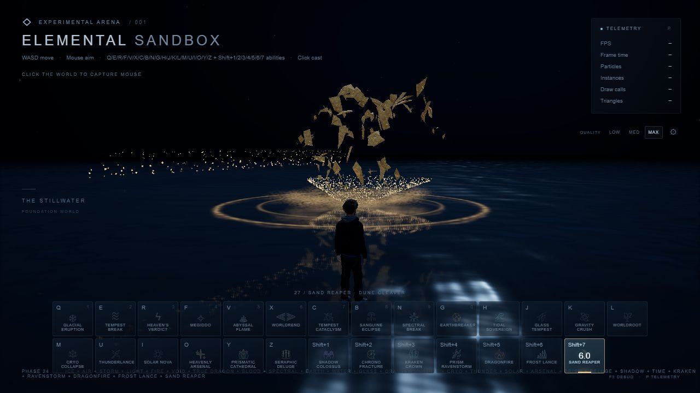
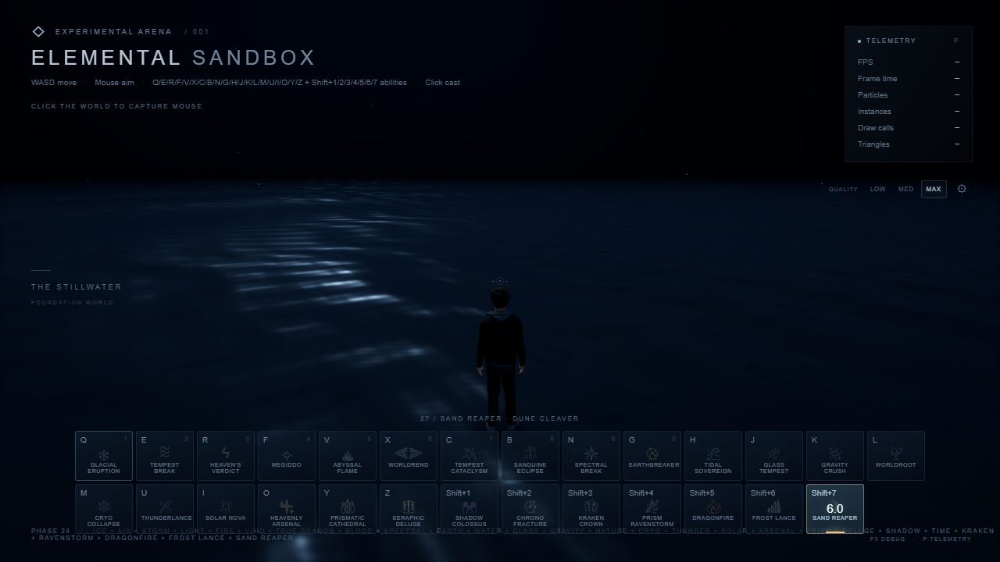

# Phase 24 — Sand Reaper / Dune Cleaver

Validated 2026-10-10. Exactly one new ability, **27 / Shift+7**. All previous 26 registrations remain. Normal 7 remains Tempest Cataclysm, normal 6 remains Worldrend, Shift+6 remains Frost Lance. No commit, push, PR, deployment or publication commands were run.

## Engineering reference and attribution

Consulted the current [threejs-ability-sandbox reference](https://github.com/sandaoliu1234/threejs-ability-sandbox), including its procedural rendering/editor description. Retrieval of the requested current `src/` pages/raw particle files was unavailable through the web tool. No history search was attempted. Used the already supplied, restored local snapshots in `frost-lance-donor-sources/`: `ProceduralGeometry.js` / `createCrystalGeometry`, `IceMaterial.js` / `createIceMaterial`, `IceAbility.js`, `Ability.js`, `noise.glsl.js` and `settings.js` / `settings.ice`. They document deterministic ring sweeps, non-indexed facets, patched standard materials, local/world noise separation, per-instance data, rate-based emission, phase sequencing and reset/destroy ownership. The restored snapshots are not a verified historical Git commit.

No donor engine, gameplay, geometry generator or ice material was copied into the sand spell. The existing attributed `FrostLanceNoise` utility supplies simplex, three-octave fbm and four-octave ridged noise. The existing donor MIT notice is retained and its coverage records this reuse. Added the verified upstream [Ashima/Gustavson MIT notice](https://github.com/ashima/webgl-noise/blob/master/LICENSE) in `public/licenses/WebGLNoise-MIT.txt`. Crescent geometry, sandstone shading composition, sand motion, assembly and fracture placement are original.

## Added code

- `src/abilities/sandReaper/SandReaper.ts`: registry metadata, safe target snapshots, 42m clamp, six-second cooldown, lazy shared geometry, bounded two-lease cache, validated live configuration.
- `SandReaperConfig.ts`: typed finite controls, shape rebuild policy, central quality translation.
- `SandReaperGeometry.ts`: original watertight crescent sweep and four closed angular fragment variants.
- `SandReaperMaterial.ts`: opaque, physically lit standard material with procedural stone and mineral seams.
- `SandReaperParticles.ts`: bounded GPU sand/dust/droplet buffers and four instanced, standard-lit rock batches.
- `SandReaperImpact.ts`: grain-modulated pressure crest and restrained water reflection overlay.
- `SandReaperEffect.ts`: charge, launch, distance-based flight, fracture, residual lifecycle, lighting, camera response and owned water interaction.
- `tests/sand-reaper.spec.ts`: topology/winding/normal/determinism checks, targeting, quality, tuning and repeated lifecycle tests.
- This report, four screenshots, final LOW/MEDIUM/MAX runtime reports, MAX stress/regression reports, and earlier LOW/MEDIUM regression evidence in `docs/phase24-*`.
- `public/licenses/WebGLNoise-MIT.txt`.

## Shared files modified

`src/game/Game.ts` (one import/registration/slot), `src/abilities/AbilitySlot.ts` (append Shift+7), `src/player/PlayerVisual.ts` (optional additive right-arm cast overlay), `src/ui/AbilityBar.ts` (original crescent icon), `src/ui/HUD.ts` (shortcut/phase/subtitle metadata), `src/styles/game.css` (14 columns to fit 27 cards in two desktop rows), `tests/audit.spec.ts` (27 slots and seventh modifier parity), `tests/audit-browser.ts` (sand-focused runtime/stress paths), `tests/audit-review.ts` (step/freeze the cast pose with the visual timeline), `README.md`, `public/licenses/LinearAbilityExtThreeJS.txt`.

No existing ability implementation was modified, including Frost Lance, Glacial Eruption, Kraken or Prism Ravenstorm. The renderer, camera/controller, input manager, targeting, EffectManager, quality presets and water source are unchanged. No dependencies added.

## Geometry and shader

The centerline samples an open 244-degree arc. Six radial/depth cross-section vertices create a thick central spine, two thin edges and genuine **0.48m** maximum thickness. The **3.8m** blade tapers to a single sharp apex at each end. Cross-section width/thickness taper with arc position; deterministic perturbations chip the facets without scrambling the silhouette. Alternating triangle diagonals add facet variation. Closed end fans, outward winding, bounding box/sphere and non-indexed unit face normals are generated once. LOW/MEDIUM/MAX meshes contain **180/324/468 triangles**. Four original closed shard solids represent a splinter, wedge, mineral shard and curved fragment.

Three.js standard lighting, flat shading, roughness (~.84), metalness (.06), shadows and its scale-correct instanced normal transform are retained. The stone remains opaque. Local-space simplex/fbm attaches grain, strata, erosion and sparse fissures to the moving blade. MAX adds ridged mineral detail. View-dependent facet/rim shading is restrained; only fissures and edges have a small warm emission, with a subtle artistic body fill for readability in this unusually dark world. Animated world-space noise modulates loose sand flowing through the seams. Quality and phase uniforms update without shader recompilation. No raymarching, external textures, refraction pass or renderer replacement.

## Timeline and targeting

- 0–.54s: additive arm raise, granular wrist suction, converging angular pieces and center-out shader reveal; the complete geometry is recognizable before release.
- .62s: launch with a .008 / .065s camera impulse. Position follows the animated right hand during charge, then takes a release snapshot.
- Flight: 40m/s straight travel; quaternion axis orientation plus restrained 2.4rad/s spin. The blade center travels above the water to preserve both tips. Existing ground targeting supplies the horizontal endpoint; the 42m cap is rechecked at release if the player moved during charge. Camera-direction fallback handles invalid hit coordinates safely.
- Actual arrival: the blade disappears into an 88/48/24-piece directional fracture. Rock birth positions sample the original crescent arc transformed by the actual impact orientation, so the fragments initially retain its silhouette. Ground sand, droplets, dust and pressure rings spread below. .02 / .15s impact camera impulse.
- Residual: 2.8s maximum. Rocks tumble with inertia/drag/gravity, shrink or sink; sand disperses and shallow dust settles. Complete default lifecycle about **3.5–4.5 seconds** depending on distance.

Charge uses the existing bones when available. The optional upper-arm overlay restores the previous mixer pose before every update, then blends its adjustment after the locomotion mixer. It has a short automatic envelope and never alters player yaw, leg animation or controller state. Missing arm bones simply skip the pose; hand anchors still function.

## Particle and water ownership

Four rock InstancedMeshes each hold at most 24 matrices and share the four ability-owned geometries. A fixed array of 96 records is integrated using reused vectors/quaternions/Object3D. Sand, granular shallow dust and elongated fine droplets use three fixed instanced-attribute ring buffers; birth, velocity/life and shape/seed attributes drive GPU motion, drag, gravity, turbulence, spin and fade. Dust uses a noisy, edge-faded mask rather than opaque squares or bubbles. No per-grain Mesh/Material and no per-frame geometry rebuilds.

Flight adds a cheap owned disturbance roughly every 2.2m. Impact calls the existing WaterInteractionManager for three outward wave components. The existing reflection captures the physical weapon/debris and warm illumination. An effect-owned grain-modulated pressure overlay gives a thin crest and brief pale gold surface reflection. Dust stays shallow above the water; droplets and fragments fall through it. No permanent terrain.

One unshadowed PointLight follows charge/flight/impact on MEDIUM/MAX; LOW disables it. Lease disposal removes the root/light, unsubscribes quality, resets buffers and removes only its own water disturbances. GPU resources are intentionally cached across casts. Ability/game disposal destroys the two bounded visual bundles, their instance resources/materials and shared geometry exactly once.

## Quality budgets

| | LOW | MEDIUM | MAX |
|---|---:|---:|---:|
| Arc segments | 16 | 28 | 40 |
| Impact rocks | 24 | 48 | 88 |
| Sand buffer slots | 420 | 1100 | 2400 |
| Dust slots | 24 | 56 | 100 |
| Droplet slots | 28 | 60 | 110 |
| Noise | Simplex grain | Three-octave fbm | fbm + ridged mineral |
| Temporary light | Off | One | One |

The silhouette stays three dimensional on LOW with bloom disabled. All tiers derive from the existing central GraphicsSettings. `SandReaper.configure(patch)` validates/clamps controls. Scalars remain live; changing length/width/thickness/curvature/facet perturbation rebuilds the shared cache only while idle, with an explicit error if attempted during an active lease. No new GUI.

## Verification and measured results

- Production build, production strict TypeScript and standalone strict checks of review/runtime/new-test modules passed. Existing Vite >500KB chunk warning remains nonfatal.
- **70 automated tests passed.** New checks verify every edge has exactly two incident triangles, positive signed volume, nonzero triangles, finite unit face normals and deterministic geometry for all three LODs/four fragments. Tests also cover range safety, live scalar tuning, guarded shape rebuilds, tier budgets, 20 casts, owner/subscription cleanup and the two-lease cap.
- Actual browser testing was sequential **LOW → MEDIUM → MAX**, with normal-speed playback and real Game input/targeting/cooldown/rendering. Shift+7/HUD selection, click cast, cooldown rejection, finite geometry/instance bounds, natural completion, scene/light/subscription/water cleanup, WebGL state all passed.
- Native browser Shift+7 selected Sand Reaper; clicking the actual game canvas cast it. Native normal 7 selected Tempest Cataclysm. Model remained loaded, with actual visible hand pose/assembly.
- Rendered visual inspection: early assembly, assembled weapon, flight and reflection, aerial fracture, dust/water response, and empty water after 4.6s. Normal and side viewpoints, 4m and 12m targets, and an intentionally out-of-range 55m aim clamped to 42m were inspected. Facets were refined to reduce busy initial stone noise; impact shards were refined to originate from the airborne blade rather than the water.
- Final MAX regression passed for Frost Lance, Glacial Eruption and Tempest Break. Earlier LOW/MEDIUM regressions also passed. Console warning/error collections were empty. No observed WebGL context loss or severe stall.
- Actual browser stress: **20 sequential Sand Reaper casts**, **100 cooldown attempts**, Walk/Run/Idle preservation, live quality menu and full game disposal passed. Warmed counts before/after were identical: **106 scene objects, 0 lights, 5 quality subscriptions, 0 active effects/ripples, 18 geometries, 21 textures, 30 programs**. Full disposal yielded zero renderer-tracked geometries/textures and zero subscriptions.

Final normal-speed measurements at 1280×720 in the Codex in-app browser (an extra observation render is submitted by the audit):

| | LOW | MEDIUM | MAX |
|---|---:|---:|---:|
| Peak spell particles | 437 | 1125 | 2411 |
| Peak rock instances | 24 | 48 | 88 |
| Peak renderer calls | 16 | 47 | 47 |
| Peak renderer triangles | 13056 | 52419 | 91223 |
| Median RAF interval | 6.1ms | 6.1ms | 6.1ms |
| p95 RAF interval | 7.0ms | 6.4ms | 6.3ms |

These counters include the world, reflections, shadows and post-processing, and are not hardware GPU timer/VRAM-byte measurements. First shader compilation/cache growth is expected; warmed stress counts are stable. No long-session/native-GPU benchmark is claimed. The unrelated earlier Kraken issue is not altered or claimed fixed.

Evidence: [LOW](phase24-low-final.txt), [MEDIUM](phase24-medium-final.txt), [MAX](phase24-max-final.txt), [stress](phase24-max-stress.txt), [regression](phase24-max-regression.txt).

