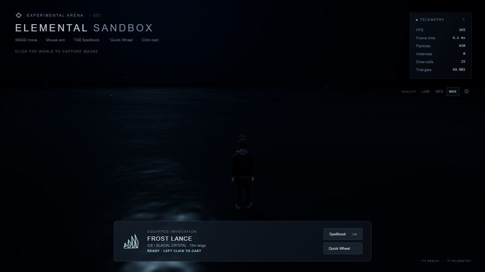
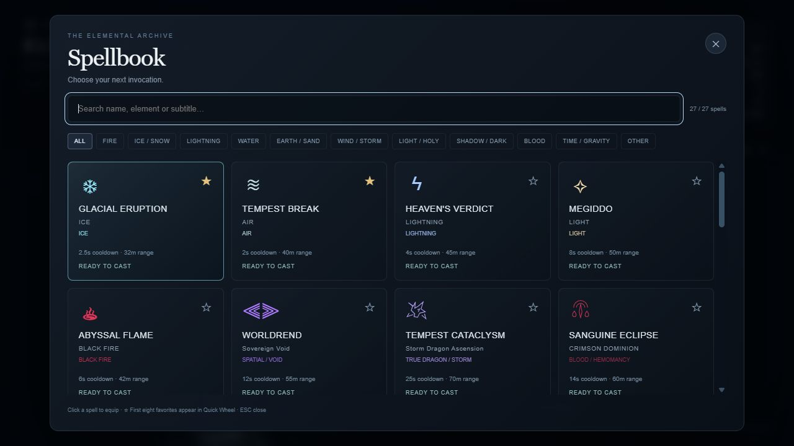
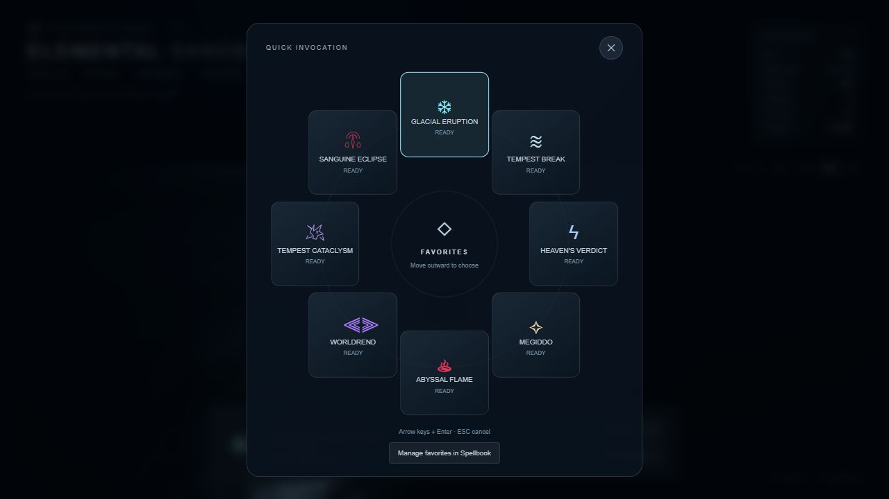
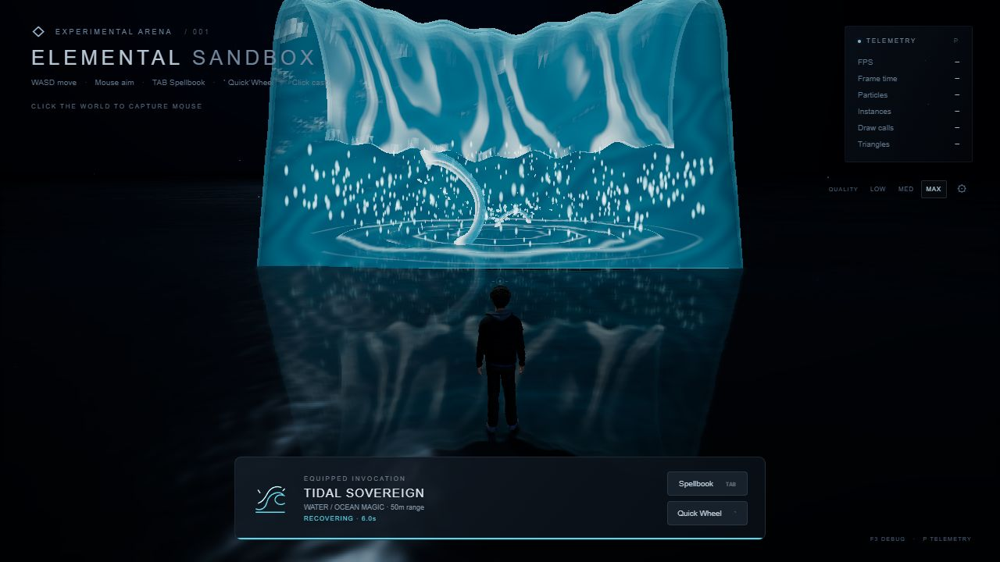

# Phase 25 — Elemental Spellbook and cinematic ocean

Validated locally on 2026-10-10. All **27 existing spells** remain registered. No new spell, renderer, gameplay system or dependency was introduced. I did not run any commit, push, PR, deployment or publication commands. During final validation, the repository advanced externally to commit 1b3d72d; I left it untouched. This final report and the production screenshot remained uncommitted at the last check.

## Spell selection

- **Tab** / HUD Spellbook button opens a native modal dialog. Tab then navigates its controls normally; Escape cancels; canvas focus returns on close.
- Cards and count come from AbilityRegistry, with original names, subtitles, icons, colors, configuration ranges and cooldowns. Search matches name, subtitle, element, category and optional tags. Categories derive from element metadata; Kraken is WATER, Glass Tempest is EARTH / SAND, Ravenstorm is LIGHT / HOLY. Unknown elements appear under OTHER.
- Card selection calls AbilityManager. Selection neither casts nor clears an active effect. Cooling spells remain selectable. The compact equipped-spell HUD shows authoritative ready/cooldown state and range.
- Favorites use validated, deduplicated, ordered stable IDs in localStorage. Missing IDs are removed; denied/corrupt storage fails safely. The first eight favorites occupy the wheel. Unfavorite/re-favorite changes order.
- Hold **Backquote (`)**, move outward and release to equip. The center dead zone, empty sectors and release without intent preserve selection. The visible Quick Wheel button supports international keyboards and click selection. Arrow keys + Enter select; Escape cancels. Empty favorites offer a Spellbook entry.
- Opening either overlay releases pointer lock and clears held keys, mouse deltas and pending casts. UI clicks cannot cast through it. Existing numeric/modifier shortcuts, WASD, Shift sprint, mouse camera, world left-click, P telemetry and T marker remain unchanged. The legacy bar remains hidden for compatibility with existing audit tools.
- Registering a future ability updates the catalog without editing UI lists; an unbound registered ability can be selected without adding a numeric shortcut.

## Ocean implementation

The existing single 6 km water mesh, warped near-player BufferGeometry, clipped planar reflection target, dynamic-light buffer and source-owned ripple API remain in use. Geometry is replaced/disposed only when the quality tier changes; its positions are not rebuilt or uploaded every frame.

One coherent Gerstner spectrum provides horizontal and vertical displacement: two broad swells, two medium waves and one short wave. Wavelength-dependent deep-water dispersion, amplitude, direction, speed and steepness are uniform-driven. Analytic surface tangents produce geometric normals and crest compression. A smooth contact attenuation zone keeps the existing player/ground coordinate system stable, with its derivative included in normals.

Fragment detail adds filtered simplex / three-octave fbm and directional capillary wrinkles. Screen derivatives reconstruct world-space gradients with numerical guards; footprint/distance attenuation reduces grazing-angle shimmer. This replaces the previous independent height/slope equations. Dark depth-like color variation, water F0 approximately 0.02 Schlick Fresnel, roughness-sensitive GGX-like specular and the existing five-tap filtered mirror produce view-dependent highlights and spell reflections. Output remains in the existing tone-mapping pipeline.

Existing bounded ripple uniforms now drive both displaced Gaussian wavelets and analytic radial slopes. Front propagation, radial/time decay and strength limits keep impacts local and finite. Broken procedural foam follows crest compression and impact slopes, with a restrained brightness cap. The common water API feeds stronger impacts into one 256-slot GPU droplet ring buffer, with a maximum of 128 new impact droplets per frame. Shoe spray remains supported. No spell received decorative water logic individually.

**F3 in development** reveals the Ocean VFX editor: waves, normal detail, roughness/specular, reflection/Fresnel, palette, foam/ripple/spray and budgets. Scalar/color edits update uniforms without material reconstruction. Values are finite-validated and bounded; tier budgets remain ceilings. Reset restores defaults. The editor is omitted from production builds. Ocean edits are session-local; favorites persist.

The reference project's procedural rendering approach was consulted. The ocean reuses the project's already-attributed `FrostLanceNoise` simplex/fbm utility; the existing MIT notices in `public/licenses/LinearAbilityExtThreeJS.txt` and `public/licenses/WebGLNoise-MIT.txt` remain intact. No donor engine was imported or copied.

## Graphics presets

| Preset | Gerstner waves | Grid vertices | Ripple ceiling | Planar reflection | Dynamic water lights |
| --- | ---: | ---: | ---: | --- | ---: |
| LOW | 2 | 1,089 | 8 | Disabled; procedural sky response retained | 4 |
| MEDIUM | 4 | 9,409 | 20 | 384 px, interleaved every 3 frames | 8 |
| MAX | 5 | 25,921 | 32 | 768 px, interleaved every 2 frames | 12 |

LOW uses simpler normal noise and reduced impact spray; MAX adds fine wrinkles. Existing particle, pixel-ratio, bloom and shadow budgets still apply. Editor values cannot exceed the selected tier's wave/normal/ripple ceilings.

## Actual validation

- `npm run typecheck`: passed. `npm run build`: passed. `npm test`: **75 passed**, including catalog, future registry selection, favorite persistence/sanitization, finite ocean editing and bounded spray tests; all 70 previous tests remain.
- `git diff --check`: passed. Existing Vite chunk-size warning remains; no runtime dependency added.
- Real in-app browser: all 27 cards, subtitle search, category filters, favorite toggle/persistence, native focus traversal/Escape, eight-entry wheel, keyboard confirmation, mouse wedge/dead-zone release, equip without casting and overlay input isolation passed.
- Real world click started the selected spell's actual cooldown. Selecting another spell while it ran preserved its effect. WASD, sprint, finite targeting, F3 editor and live uniform edits passed.
- Real browser LOW → MEDIUM → MAX checks produced the vertex/wave/ripple counts above and no WebGL errors. Fifteen subsequent live quality/parameter changes returned to identical counts: **106 scene objects, 0 temporary lights, 10 geometries, 21 textures, 5 graphics subscriptions** after a warmed Glacial cast.
- Seven recommended regressions passed on **each** tier: Glacial Eruption, Tidal Sovereign, Kraken Crown, Prism Ravenstorm, Frost Lance, Sand Reaper and Dragonfire. Checks cover shortcuts, click casts, cooldown rejection, finite/bounded geometry, natural completion, scene/light/subscription/ripple cleanup and WebGL NO_ERROR.
- **20 Sand Reaper LOW casts** and **20 Frost Lance MAX casts** restored their warmed GPU/scene/subscription baselines. Both stress runs also rejected 100 rapid cooldown requests, preserved Walk/Run/Idle, and released all geometries/textures/subscriptions on full Game disposal. Two overlapping Frost Lance fields and their shoe ripples expired safely.
- Browser console logs were clean during final development and production inspection. Production preview displayed all 27 Spellbook cards and **no Ocean VFX editor**, including after F3. Local preview was stopped after testing.
- Desktop layouts inspected at **1280×720, 1920×1080 and 2560×1440**; dialogs stay within viewport bounds and their catalog scrolls. Browser viewport override was reset afterwards.

Browser reports are saved under `docs/phase25/`: `ui-ocean.txt`, `regression-low.txt`, `regression-medium.txt`, `regression-max.txt`, `stress-low.txt`, `stress-frost-max.txt`.

The accelerated lifecycle regression harness recorded RAF medians **6.0–6.1 ms** at 1280×720, with median CPU render submission **0.1–0.4 ms**. These are browser scheduling / CPU submission measurements, **not GPU timings or a guaranteed desktop FPS**. One MEDIUM Dragonfire cold/initial frame reached approximately **194 ms**; subsequent MAX run's maximum was approximately 16 ms. Per-spell raw samples, peaks and resource counts are retained in the reports rather than hidden by an average. No severe multi-second stall occurred in these runs.

## Rendered evidence and visual comparison

Compared with the existing [Phase 24 baseline](phase24-expired.png), the new default water is darker and its highlights are less uniformly banded. The new surface combines broad geometric motion and finer directional detail. Inspected ordinary and low camera angles, reflected water impacts, standing ice and fire. Frost ground patterns and ice formation remain readable; the player stays aligned at the contact zone. This is an aesthetic comparison, not an identical-time physical benchmark.

Additional evidence: `ocean-low-angle.png`, `frost-water.png`, `fire-water.png`, `ocean-editor.png`, `spellbook-1920.png`, `spellbook-2560.png`, `production.png` in `docs/phase25/`.

## Limits

This is a bounded procedural ocean, not a fluid solver. Reflections use a distorted mean-plane mirror and procedural sky approximation, without SSR, ray tracing, HDR/PMREM capture or true wave-by-wave reflection visibility. Interleaved reflections can lag fast effects. The logical targeting/player surface remains y=0; there is no buoyancy or underwater system. Very thin distant ground overlays can intersect swell crests, although inspected Frost Lance/ice/fire views remained readable. Spray is a bounded visual response to strong existing ripple emissions, not simulated splashes for every independent fragment. Defaults deliberately represent a calm, dark sea. Ocean editor settings are not persisted. Runtime regression casting was sampled for seven abilities; the other abilities retain their original implementation and automated coverage but were not individually visually re-reviewed this phase.

## Added files

- `src/ui/SpellCatalog.ts`
- `src/ui/SpellFavorites.ts`
- `src/ui/SpellIcon.ts`
- `src/ui/Spellbook.ts`
- `src/ui/SpellQuickWheel.ts`
- `src/ui/SpellSelection.ts`
- `src/ui/OceanVFXControls.ts`
- `src/styles/spellbook.css`
- `src/world/water/OceanSettings.ts`
- `tests/phase25.spec.ts`
- `tests/phase25-browser.ts`
- `phase25-review.html`
- This report and the evidence files listed above.

## Modified files

- `README.md`
- `src/abilities/Ability.ts`
- `src/abilities/AbilityManager.ts`
- `src/abilities/AbilityRegistry.ts`
- `src/abilities/blood/SanguineEclipse.ts`
- `src/abilities/chrono/ChronoFracture.ts`
- `src/abilities/cryo/CryoCollapse.ts`
- `src/abilities/dragonfire/Dragonfire.ts`
- `src/abilities/earth/Earthbreaker.ts`
- `src/abilities/fire/AbyssalFlame.ts`
- `src/abilities/frostLance/FrostLance.ts`
- `src/abilities/glass/GlassTempest.ts`
- `src/abilities/gravity/GravityCrush.ts`
- `src/abilities/heavenlyArsenal/HeavenlyArsenal.ts`
- `src/abilities/ice/GlacialEruption.ts`
- `src/abilities/kraken/KrakenCrown.ts`
- `src/abilities/light/Megiddo.ts`
- `src/abilities/lightning/HeavensVerdict.ts`
- `src/abilities/nature/Worldroot.ts`
- `src/abilities/prismRavenstorm/PrismRavenstorm.ts`
- `src/abilities/prismaticCathedral/PrismaticCathedral.ts`
- `src/abilities/sandReaper/SandReaper.ts`
- `src/abilities/seraphicDeluge/SeraphicDeluge.ts`
- `src/abilities/shadowColossus/ShadowColossus.ts`
- `src/abilities/solar/SolarNova.ts`
- `src/abilities/spectral/SpectralBreak.ts`
- `src/abilities/stormDragon/TempestCataclysm.ts`
- `src/abilities/thunderlance/Thunderlance.ts`
- `src/abilities/void/Worldrend.ts`
- `src/abilities/water/TidalSovereign.ts`
- `src/abilities/wind/TempestBreak.ts`
- `src/game/Game.ts`
- `src/game/InputManager.ts`
- `src/styles/game.css`
- `src/ui/AbilityBar.ts`
- `src/ui/HUD.ts`
- `src/world/DarkWater.ts`
- `src/world/water/WaterContactSpray.ts`
- `src/world/water/WaterInteractionManager.ts`
- `src/world/water/WaterShader.ts`
- `src/world/water/WaterWaveField.ts`
- `tests/audit-browser.ts`

The 27 individual ability files above received only a readonly range field sourced from their existing configuration. No spell geometry, shader, timeline, cooldown or shortcut was changed. AbilityBar icons were extracted intact into SpellIcon so the new UI shares their existing assets.
