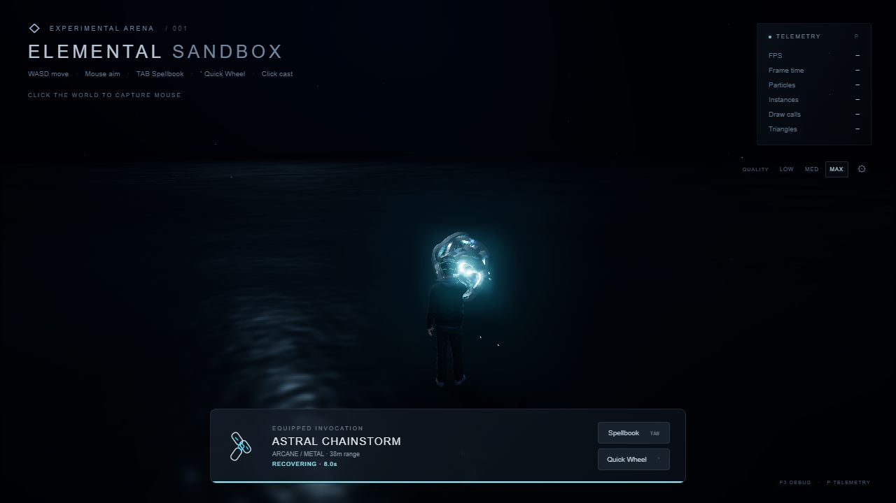
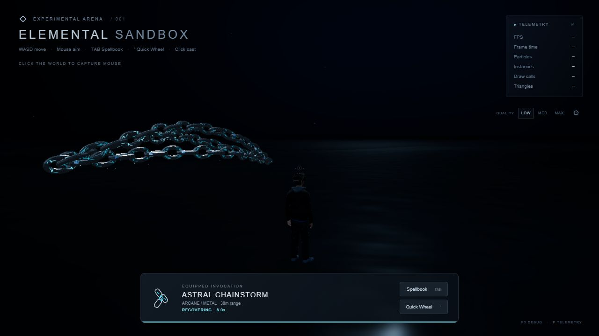
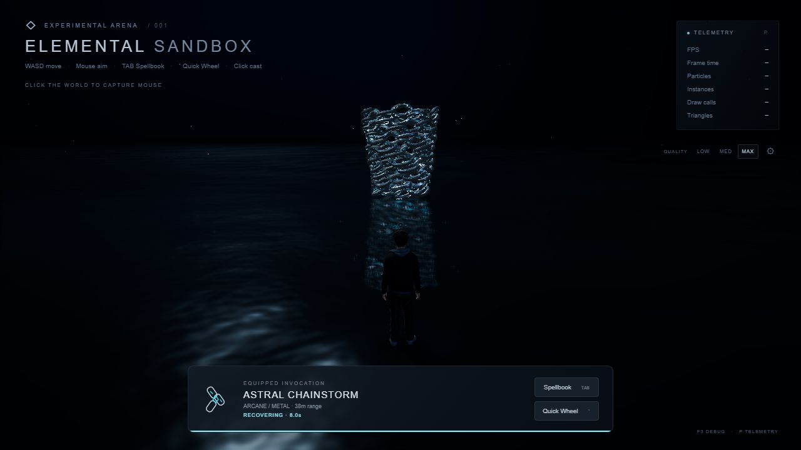
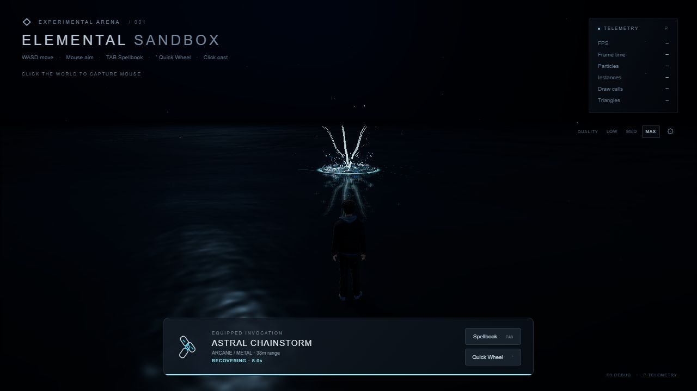
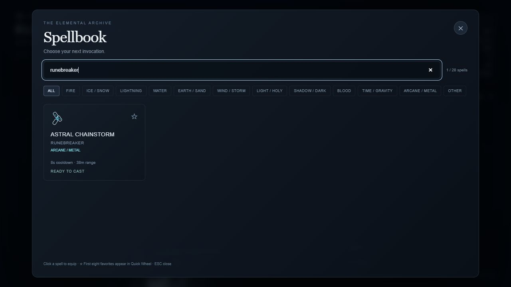

# Phase 26 — Astral Chainstorm: Runebreaker

Implemented one new ability, **#28, ARCANE / METAL**. The previous 27 registrations, cooldowns and keyboard bindings remain intact. Choose Runebreaker through **Tab → Spellbook**, search its name/subtitle, or favorite it for the existing **` Quick Wheel**. Equipping never casts; left click casts. No numeric or Shift shortcut was added. WASD, Shift sprint, mouse camera, P telemetry and F3 ocean editor remain available.

## Behavior and rendering

- Cooldown: **8 seconds**. Maximum cast range: **38 meters**, safely clamped using the existing targeting context. Invalid/non-finite targets are rejected; valid camera direction supplies a fallback.
- Release: **0.75 seconds**, after right-hand charge and sequential assembly. The hand anchor follows the animated player until release; the target is snapshotted and range checked again at launch.
- Flight: **34 meters/second** with a short exponential acceleration ramp. Arrival is calculated from actual travel distance, rather than a fixed impact timer.
- Arrival transitions into a **0.65-second** helical cage, **0.4-second** constriction, **0.18-second** downward slam and **1.5-second** residual fade. Default total duration is approximately **3.6–4.7 seconds**, depending on distance.
- Restrained launch/impact camera impulses; at most two temporary light objects per leased bundle, disabled on LOW. Nothing adds damage, targets or enemies.

Each link is a closed procedural oval mesh, built around an elliptical centerline with an octagonal forged cross-section, small deterministic surface perturbations and continuous perimeter UVs. Three geometry LODs use 20/32/44 centerline samples. Indexed construction is converted to non-indexed triangles for hard facet normals. Tests verify finite bounds, nondegenerate triangles, closed geometric edges, positive winding volume and unit normals. Thickness is constrained to keep the center hole open. Two closed angular steel-fragment geometries supply the impact debris.

One bounded InstancedMesh renders all links. Preallocated 129-point paths per chain and arc-length lookup preserve link spacing. Parallel-transported frames orient each link along the chain tangent; alternating links rotate 90 degrees around their longitudinal axes. Flying links keep a stable head-anchored identity as the visible trail changes length, preventing orientation and rune popping. Flight uses controlled fan spread, vertical arches and whip motion; wrapping smoothly blends those paths into a helical cage. Constriction reduces radius and height while adding turns; the final slam follows the sampled ocean surface.

The opaque MeshStandardMaterial uses metalness 0.92, configurable roughness, direct light response and a modest directional steel sheen. Local-space simplex noise, three-octave fbm and a MAX-only ridged layer produce scratches and variation in color/roughness. Engraved rune stems, chevrons and crossbars are deliberate distance-function shapes, limited to selected faces. Per-instance progress/seed/chain attributes drive narrow traveling cyan pulses. Charge and constriction brighten the runes, rather than making the entire chain emissive. Screen-space dither removes the physical metal over 0.65 seconds after impact.

The current scene does not supply a dedicated HDR environment map: the material accepts one if provided, but current metal highlights combine existing lighting with the shader sheen approximation. The ocean's existing reflected-scene pass reflects the actual chain formation.

GPU Points use fixed birth/velocity/lifetime buffers and analytic drag, gravity and drift, with soft streaks or angular dissolving rune masks. Buffers upload only when emission/reset changes them. Two lit InstancedMeshes render angular steel debris, with preallocated rotation/velocity records. Emission rates, catch-up work, particle counts and fragment counts are bounded; no per-frame curve/geometry construction occurs. A short seven-branch 3D fracture discharge and thin pressure crests complete the impact.

## Ocean integration and shared changes

The existing ocean renderer remains in place. Its unchanged five-wave spectrum now supplies both GPU displacement and a finite CPU surface-height sampler. Four bounded inverse-horizontal iterations sample the same Gerstner equations, player-contact attenuation and current ripple wavelets. The spell samples this API to align the slam with moving water, then submits four owned, 1.4-second disturbances through the existing interaction manager. Existing reflection, contact-spray and ripple systems render the response.

Visual inspection exposed an existing spray-buffer issue: Float32BufferAttribute copied the CPU emission arrays, leaving shader attributes stale. WaterContactSpray now wraps the original arrays with BufferAttribute and DynamicDrawUsage. Its finite supplied impact height is respected; existing zero-height inputs keep their behavior. A regression test checks the actual uploaded GPU-source attributes.

## Quality and live tuning

| Preset | Chains × link ceiling | Mesh samples | Spark ceiling | Impact fragments | Lighting/detail |
|---|---:|---:|---:|---:|---|
| LOW | 3 × 26 = 78 | 20 | 130 | 24 | No spell lights; reduced noise |
| MEDIUM | 4 × 34 = 136 | 32 | 350 | 48 | Restrained lights; richer scratches/runes |
| MAX | 5 × 40 = 200 | 44 | 750 | 80 | Ridged detail; richest bounded emission |

These are ceilings; short paths deliberately draw fewer links. Particle budgets also obey the central GraphicsSettings limit. Active effects respond to live preset changes. Each leased bundle has a fixed maximum of 210 link slots, 900 point slots and 84 debris records; shader detail and draw counts vary without rebuilding every frame.

`AstralChainstorm.configure(patch)` exposes typed, finite, bounded controls for count, link dimensions/spacing, launch speed, whip amplitude/frequency, wrap radius/speed, constriction duration, rune brightness/pulse speed, roughness, scratch scale, spark density, debris count, impact intensity and ripple strength. Scalar controls update live; timing changes take effect on the next cast so arrival cannot jump ahead of the projectile. Link shape changes require an idle ability and explicitly rebuild the bounded cached geometry. No additional GUI was introduced; the F3 ocean editor is preserved.

## Ownership and cleanup

EffectManager updates the timeline. No timers, global callbacks or accumulating animation handles are used. On completion the root and both light objects leave the scene, water ownership is removed, active arrays reset, and the quality subscription is released. At most two visual bundles are retained for reuse, avoiding repeated GPU allocation after warm-up. Ability disposal destroys their geometries/materials and buffers. One lease never disposes another lease's resources. Full Game disposal released GPU geometries/textures and subscriptions to zero in the browser test.

## Validation on the home PC

- `npm install`: succeeded, no dependency additions.
- `npm run typecheck` and `npm run build`: passed. Vite retains its existing large-chunk advisory.
- `npm test`: **81 passed**, including six new geometry, target, selection/cooldown, quality, animation-spacing, lifecycle and water-height tests.
- `git diff --check`: passed.
- Actual localhost browser tested **LOW first, then MEDIUM, then MAX**. Shader-error hooks, console inspection and WebGL error checks were clean. Registration/card count 28, subtitle search, favorites, Quick Wheel, equip-without-cast, left-click cast, 8-second cooldown and 100 rejected cooldown attempts passed.
- All seven effect phases were observed by the running browser harness; bounded instance matrices stayed finite, flight reached the target before impact, owned water disturbances appeared and natural expiry removed the effect. Walk, Run and Idle, camera aiming, telemetry and F3 editor passed.
- LOW/MEDIUM/MAX gameplay-target profiles respectively peaked at **78/112/140 drawn links**, **130/350/482 particles**, and **16/47/47 draw calls**. RAF intervals were approximately 6ms median / 6.5ms p95 in this browser. These are scheduling observations, **not GPU timings or a guaranteed hardware FPS result**.
- MAX warmed both cached leases across preset switches, then ran **20 controlled, accelerated lifecycle casts**. Before/after counts matched exactly: 106 scene objects, 0 temporary lights, 7 scene-referenced materials, 25 GPU geometries, 21 textures, 40 shader programs, 5 central subscriptions, 0 active effects and 0 ripples. The material count excludes detached cached materials. This proves bounded warmed resource behavior; it is not a real-time overlapping GPU benchmark. Unit coverage also checks overlap limits and rejects a third simultaneous lease.
- Existing Glacial Eruption, Tidal Sovereign, Kraken Crown, Prism Ravenstorm, Frost Lance, Sand Reaper and Dragonfire passed browser regressions in LOW and MAX. Their implementation modules were not modified.
- The separate Spellbook/ocean browser regression passed search/filtering, focus/input blocking, selection, eight-entry wheel bounds, Escape/cancel, authoritative cooldown, movement, F3 live uniform edits, and 15 quality/parameter changes with stable resources.

Rendered visual inspection covered the normal gameplay camera and side camera: compact hand charge, hollow alternating links in flight, metallic facets, cyan rune accents, cage/reflection, constriction and the final reflected water impact. Screenshots are frozen actual WebGL renders for phase inspection; the workflow tests above run the live game.

Evidence: [LOW workflow](phase26/browser-low.txt), [MEDIUM workflow](phase26/browser-medium.txt), [MAX stress](phase26/browser-max-stress.txt), [original spells LOW](phase26/regression-low.txt), [original spells MAX](phase26/regression-max.txt), [Spellbook/ocean regression](phase26/spellbook-ocean-regression.txt).

## File inventory

New ability modules under `src/abilities/astralChainstorm/`:

- `AstralChainstorm.ts`: registry metadata, target validation, typed tuning and bounded pool.
- `AstralChainstormConfig.ts`: defaults, control validation and central-quality translation.
- `AstralChainGeometry.ts`: closed procedural links and debris variants.
- `AstralChainMaterial.ts`: lit steel, scratches, engravings and moving rune pulses.
- `AstralChainAnimation.ts`: sampled paths, stable spacing, quaternion frames and phases.
- `AstralChainParticles.ts`: bounded GPU points and instanced steel debris.
- `AstralChainImpact.ts`: thin pressure rings and brief 3D fracture discharge.
- `AstralChainstormEffect.ts`: timeline, hand tracking, water integration and lifecycle.

New validation files: `tests/astral-chainstorm.spec.ts`, `tests/chainstorm-browser.ts`, `chainstorm-review.html`, this report and `docs/phase26/` evidence.

Shared files modified: `src/game/Game.ts`, `src/ui/SpellIcon.ts`, `src/ui/SpellCatalog.ts`, `src/world/DarkWater.ts`, `src/world/water/WaterWaveField.ts`, `src/world/water/WaterInteractionManager.ts`, `src/world/water/WaterContactSpray.ts`, `tests/audit-browser.ts`, `tests/phase25-browser.ts`, `tests/phase25.spec.ts`, `README.md`. Changes integrate the new registration/icon/category, compatible water sampler/spray repair and acceptance counts; no previous ability source was rewritten. Existing Phase25 report/screenshots were preserved.

The donor project's procedural engineering techniques informed the approach. New link geometry, runes, paths and spell sequence are original implementation. The existing attributed FrostNoise shader utility is reused; its MIT donor/Ashima notices remain under `public/licenses/`. No donor engine or unrelated spell was copied into the architecture.

## Remaining limits

Chains use authored procedural paths, not rigid-body link collision physics. Dense cage chains can cross one another; the low-cost transport/spacing system does not solve inter-chain collisions. CPU water sampling follows the analytic shader field; it does not reproduce coarse LOW mesh triangle interpolation exactly. Large local crests can occlude part of the temporary thin pressure overlay. Tuning is a typed code API rather than a new GUI. Seven original spells received runtime regression coverage; the remaining originals are covered by preserved registrations and existing automated tests, rather than individually replayed browser casts.

No commit, push, PR, deployment or publication commands were run by this agent. During work, read-only Git inspection observed externally created commits `f3b22c2` and `97ef901` containing Phase26 code. Those commits and subsequent local edits were left intact.
