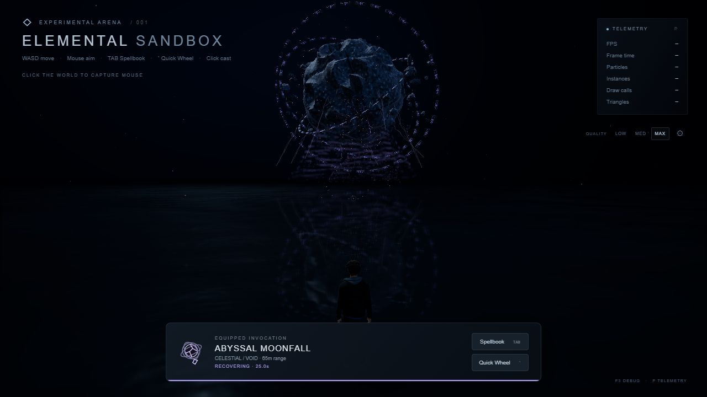
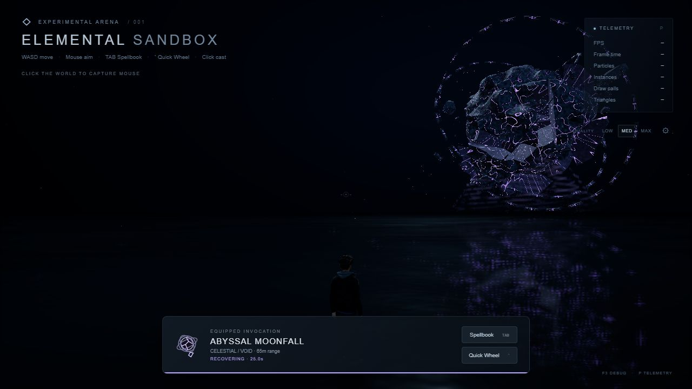
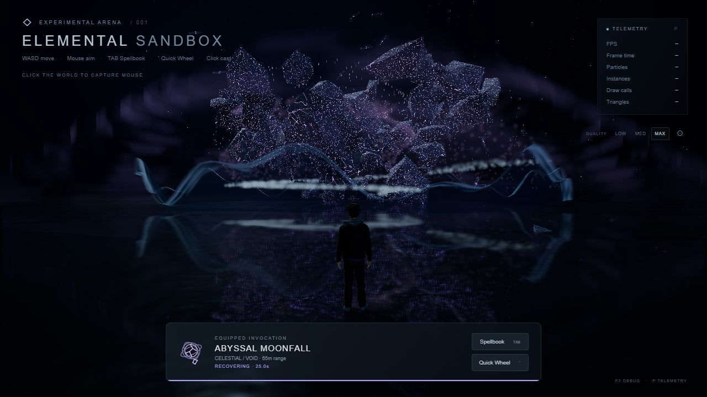

# Phase 27 — Abyssal Moonfall: Shattered Heaven

Ability **29**, **CELESTIAL / VOID**, **65m range**, **25s cooldown**, default **14s duration**. Selected through the existing Spellbook/favorites/Quick Wheel; left click casts. No new numerical shortcut.

The 70m-diameter lunar body comprises twenty closed matching solid rock sections. Deterministic CPU macro displacement creates nineteen depressed craters with raised rims, mountain relief and fault cuts. GPU attributes separate those same physical sections during assembly/fracture. Flat normals, closed perimeters, positive volume, finite bounds and nondegenerate triangles are tested. LOW/MEDIUM/MAX main-body triangle counts are **2,600 / 7,560 / 15,080**.

The opaque lit rock shader uses local-space simplex, fbm, ridged mineral detail, controlled dark cavities and thin branching violet fault masks. Progress uniforms grow cracks and pulse their energy; solid material remains attached during rotation. Three inclined, counter-rotating segmented beveled stone structures frame the moon. Four angular rock variants render satellites and debris with instancing. Fixed buffers render intermittent branching filaments, sparse winding atmosphere, dust, water streaks and angular energy grains. Existing attributed FrostLance noise is reused without removing MIT/Ashima notices; the new moon geometry and choreography are original.

Timeline: summoning 0–1s; physical assembly 1–3s; orbital storm 3–5.5s; fracture 5.5–7.5s; accelerating diagonal descent 7.5–10s; staged impact and aftermath 10–14s. Initial height is 62m, adjusted from the suggested higher range to suit the normal camera. A bounded, renewable eight-degree upward framing request keeps mouse controls active and smoothly expires. The moon starts behind the selected target and falls toward its actual sampled water point; radius never shrinks to fit the view. The casting arm accepts an optional upward elevation; existing spell calls retain their original default.

The existing ocean now accepts optional bounded displacement/falloff parameters per ripple. Ordinary ripple defaults remain unchanged. Moonfall emits seven staged owned disturbances, without increasing the 32-slot shader limit or changing global waves. A temporary GPU-deformed irregular 3D water crown, foam, spray, pressure crests, reflected light and angular debris form the impact. CPU height sampling uses the same extended wavelet parameters as GLSL.

| Preset | Body triangles | Ring segments per orbit | Satellites | Debris | Particle ceiling |
|---|---:|---:|---:|---:|---:|
| LOW | 2,600 | 18 | 18 | 32 | 900 |
| MEDIUM | 7,560 | 26 | 34 | 72 | 2,400 |
| MAX | 15,080 | 36 | 60 | 130 | 5,400 |

These lower-than-requested particle ceilings obey the central quality budgets and preserve readability. A typed validated configuration controls geometry, roughness, fractures, orbital speed/counts, storm density/radius, lightning, descent, impact, spray, water and aftermath. Tuning applies between casts; geometry changes rebuild only while idle. The F3 Ocean Editor is retained. There is at most one active Moonfall and one cached reusable resource bundle. Completion removes scene objects/light/water ownership/subscriptions; full ability teardown destroys its owned GPU resources.

## Validation

`npm install`, TypeScript, production build, **89 automated tests**, and `git diff --check` passed. The build retains the existing Vite large-chunk advisory. Eight new tests cover solid moon sections, debris/ring normals, config/quality, target/cooldown/catalog, phase/descent/finite transforms, reusable cleanup and special ocean impulses.

Actual browser playback passed **LOW → MEDIUM → MAX**, including all seven major phases, natural expiry, 100 rejected cooldown attempts, 29 cards, subtitle/name/element search, favorites, Quick Wheel, left-click, Walk/Run/Idle, camera/targeting, F3 editor, quality menu and full GPU/subscription teardown. Console and WebGL checks were clean.

| Real-time browser pass | Peak effect particles | Peak instances | Peak total draw calls | Peak rendered triangles | RAF median / p95 / maximum (ms) |
|---|---:|---:|---:|---:|---|
| LOW | 900 | 86 | 25 | 17,856 | 6.1 / 6.3 / 18.5 |
| MEDIUM | 2,400 | 150 | 65 | 72,379 | 6.1 / 6.6 / 22.5 |
| MAX | 5,400 | 238 | 65 | 125,531 | 6.1 / 6.5 / 22.7 |

Totals include the arena/reflection work. RAF intervals describe browser scheduling, not GPU timings or a promised hardware FPS. Three additional controlled sequential MAX casts were stepped faster for lifecycle validation, with each cast completing before the next. Warmed before/after counts matched: **106 scene objects, 0 temporary lights, 7 scene-referenced materials, 20 GPU geometries, 21 textures, 31 programs, 5 subscriptions, 0 effects/particles/ripples**. Detached cached materials are not included in the scene material count.

Evidence: [LOW](phase27/browser-low.txt), [MEDIUM](phase27/browser-medium.txt), [MAX and sequential cleanup](phase27/browser-max-stress.txt). Actual rendered normal, side and lower-angle views were inspected:

New modules: `AbyssalMoonfall.ts`, `AbyssalMoonfallConfig.ts`, `AbyssalMoonfallEffect.ts`, `MoonGeometry.ts`, `MoonMaterial.ts`, `MoonStructures.ts`, `MoonLightning.ts`, `MoonStorm.ts`, `MoonfallParticles.ts`, `MoonfallWater.ts` under `src/abilities/abyssalMoonfall/`. New tests/harness: `tests/moonfall.spec.ts`, `tests/moonfall-browser.ts`, `moonfall-review.html`, and this evidence folder/report.

Shared integration: Ability cast context's optional framing callback, CameraController's expiring framing request, Game registration, PlayerVisual's optional arm elevation, SpellCatalog's new category, original SpellIcon, DarkWater/WaterInteractionManager/WaterWaveField's compatible extended impulses, and existing browser harness roster expectations. No old spell implementation was overwritten.

Limits: scripted sectional breakup rather than physical fracture simulation; lightning filaments are thin line strands rather than volumetric tubes; initial composition is distant and diagonal so the large body fits the normal camera. Close targets can make the final descent dominate the frame. The water crown is a fluid VFX approximation, not a fluid solver, and coarse LOW ocean triangles cannot represent the analytic disturbance perfectly. Atmosphere and material detail are deliberately restrained. No audio or new debug GUI was added. Repeated-cast tests measure bounded resource behavior, not a real-time overlapping-ultimate GPU benchmark.

During the interrupted session an external process committed Phase27 as `f7d9171`; no agent commit, push, PR, deployment or history rewrite commands were run. Existing work was preserved. MEDIUM/MAX verification was completed before starting Phase28.
